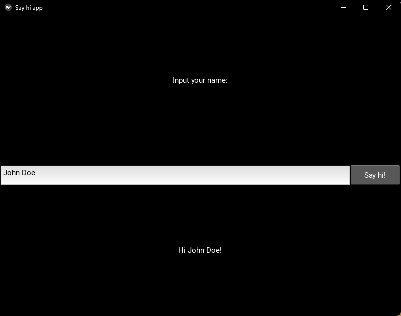

# SimpleKivy - A Modern Approach to Kivy GUI Development


A **simplified** and **intuitive** way to build **Kivy** applications, while retaining the full power and flexibility of **Kivy**.  

🚀 **Check out the [Ergo Create YouTube Channel](https://www.youtube.com/@ErgoCreate) for tutorials, examples, and live coding sessions!**  

### **Why SimpleKivy?**  

Building **Kivy** apps traditionally requires managing multiple files (`.py` + `.kv`), understanding complex widget hierarchies, and writing verbose code. **SimpleKivy** changes that by offering:  

✅ **Single-file development** – No more switching between Python and KV language.  
✅ **Rapid prototyping** – Design UIs quickly with minimal boilerplate.  
✅ **Easy modifications** – Update layouts and widgets easily.  
✅ **Beautiful by default** – Leverage Kivy's graphics engine without the hassle.  
✅ **Focus on functionality** – Spend less time on GUI code, more on backend logic.  

### **Core Philosophy**  

- **⚡ Code Faster** – Reduce setup time and get straight to building.  
- **🎨 Customize Easily** – Modify styles, layouts, and behavior without deep Kivy knowledge.  
- **✨ Make It Stunning** – Access Kivy's animations, effects, and features effortlessly.  
- **🤖 Backend-First** – Keep your app logic clean while the GUI adapts.

# **Getting started**
## Installation
***SimpleKivy has only been tested on **Windows** and on Python 3.10>. Support this project if you are interested on Linux and MacOS implementations.***
### Kivy
You need to install the latest version of `Kivy`. Installation instructions can be found [here](https://kivy.org/doc/stable/gettingstarted/installation.html).

### SimpleKivy
You can install the latest development version with:
``` bash
pip install git+https://github.com/ErgoCreate/SimpleKivy.git
``` 

⚠️ **This project is in the early stages of development and is expected to change in the future.**

⚠️ **Use it at your own risk.**

### Optional modules
The *Image* widget has new *copy/paste/save* functionalities introduced in **SimpleKivy** that require the following modules to work as expected:
``` bash
pip install pyperclipimg, requests, pillow
``` 


## Highlights
- **Simple** design philosophy. Forget about **kv** files. Write only python code and get a user interface that resembles your code! Define your layout, define an event manager, create your app and run!
- The new `MyApp` class comes with a plethora of new capabilities and functionalities.
- **WebView** widget based on [pywebview](https://pywebview.flowrl.com) (extremely experimmental but it finally works!).
- **IconFont.** Easily integrate any webfont to display icons in labels and buttons. By default, you can use the [Material Desing Icons](https://materialdesignicons.com/tag/community) webfont to display a symbol like this  as easily as setting `mdi("creation")` as the text in any widget that supports markup, similar to setting `<span class="mdi mdi-creation"></span>` in html.
- Native File-chooser/file-save implementation using tkinter.
- Boosted capabilities for widgets (background and line colors for the most used widgets).
- **Widget maths!** Easily create rows or columns of widgets using simple math operators.
    - `Label*Button = # Horizontal box with a Label beside a Button`
    - `Label/Button = # Vertical box with a Label on top of a Button`
- Integrated **multithreadding and queue management.** Useful for deploying heavy tasks without freezing your user interphase.
- **Tooltip** implementation for several widgets.
- **Flexible color definition.** The definition of colors is handled in more diverse ways. For example, you can set any color property to red in any of the following ways: 
    - RGBA iterable: `(1,0,0,1)`
    - RGB iterable: `(1,0,0)`
    - Color name from the [matplotlib list of named colors](https://matplotlib.org/stable/gallery/color/named_colors.html): `"red"` or `"r"`
    - Hexadecimal color value: `"#ff0000"`
- Define sizes more easily with strings:
    - `size = "x30"` is equivalent to `width = 30, size_hint_x = None`.
    - `size = "y60"` is equivalent to `height = 60, size_hint_y = None`.
    - `size = "x30y60"` is equivalent to `size = (30,60), size_hint = (None,None)`.
    - `size = "xchildren"` dynamically sets the width to the sum of the children's width.
    - `size = "ychildren"` dynamically sets the height to the sum of the children's height.
    - `size = "xchildrenychildren"` dynamically sets the size to the sum of the children's width and height.

# Usage

### This Code
[link](example_programs/say_hi.py)

```python
import SimpleKivy.SimpleKivy as sk

sk.auto_config() # Size, multitouch_emulation = False, etc.

# All the stuff inside your window.
lyt=[
    [sk.Label('Input your name:')],
    [sk.Input(k='i',size='y40')*sk.B('Say hi!',size='x100y40')],
    [sk.T(k='msg')]
]

# Your backend code must be inside a function with 2 arguments (app, event)
# and should be added as the event_manager argument of the MyApp class.
def evman(app,ev):
    
    # Detect the button released event
    if ev=='Say hi!':
        # Update the text of the "msg" widget
        app('msg',text=f"Hi {app['i'].text}!")

# Create the App
app=sk.MyApp(
    title="Say hi app",
    layout=lyt,
    event_manager=evman
)

# Run the App
app.run()
```

### Makes This Window



# Latest Changes
- Renamed some element classes for consistency.
- New widgets showcase: .
- More customization options for all widgets.
- Keep-on-top and alpha (transparency) options for the window.
- Expanded Label customization.
- Expanded InputText customization.
- ColorProperty.
- Default fonts can be entered as keywords (see SimpleKivy.Fonts): ```Text('Hello World', font_name='roboto it')```.
- Integrate custom widgets with the `skwidget` decorator and the `skivify` function.

# Next In The List
- **Examples and documentation.**
- **Fixing bugs and improvements to the existing widgets.**
- **Cleaning up the source code.**

# Suport Us
The best way to encourage future development and maintenance of this project is by donating.
SimpleKivy will always remain completely free, and no features will ever be locked behind a paywall. There are no special benefits to donating. This page exists for people who wish to support our effort.


[](https://www.paypal.com/cgi-bin/webscr?cmd=_s-xclick&hosted_button_id=339JUWC5BY6UN&source=url)


[Make a donation (PayPal)](https://www.paypal.com/cgi-bin/webscr?cmd=_s-xclick&hosted_button_id=339JUWC5BY6UN&source=url)

Either way, **SimpleKivy is free to use!**

**Don't forget to leave a ★**


# Supported Elements
This is a list of the supported widgets that you can use in your window layouts right now:

|                 |                  |                  |
|-------------------------|-------------------------|-------------------------|
| * **ActionBar**         | * **ClearRoundButton**  | * **FlatTButtonAngle**  |
| * **ActionButton**      | * **CodeInput**         | * **FlatToggleButton**  |
| * **ActionCheck**       | * **ComboBox**          | * **FlatToggleButtonAngle** |
| * **ActionInput**       | * **DatePicker** *(experimental)* | * **Floatit**           |
| * **ActionLabelCheck**  | * **DropDown**          | * **Grid**              |
| * **ActionPrevious**    | * **External** *(experimental)* | * **HoverBoxit**        |
| * **ActionSeparator**   | * **Fill**              | * **Image**             |
| * **ActionToggleButton**| * **FlatB**: Alias of FlatButton | * **Input**             |
| * **Albumlist**         | * **FlatButton**        | * **InputDark**         |
| * **Artistlist**        | * **FlatButtonAngle**   | * **Label**             |
| * **B**: Alias of Button| * **FlatRoundB**: Alias of FlatRoundButton | * **LabelCheck**        |
| * **BarTouch**          | * **FlatRoundButton**   | * **LargeText**         |
| * **BarTouchH**: Alias of BarTouch | * **FlatTB**: Alias of FlatToggleButton | * **ListBox**           |
| * **BarTouchV**         | * **FlatTButton**       | * **Menu** *(experimental)* |
| * **Boxit**             | * **ModalView**         | * **Multiline**         |
| * **BoxitH**            | * **PagedText**         | * **Pageit**            |
| * **BoxitV**            | * **Playlist**          | * **Popup**             |
| * **Button**            | * **ProgressBar**       | * **ProgressBar2**      |
| * **ButtonBoxit**       | * **ProgressBarTouch**  | * **RStack**: Alias of Artistlist |
| * **ButtonBoxitAngle**  | * **RStackit**: Alias of Artistlist | * **RecycleStackList**: Alias of Artistlist |
| * **CalcSheet** *(experimental)* | * **Relativeit**        | * **RoundButtonRelativeit** |
| * **Calendar**: Alias of DatePicker | * **RoundRelativeit**   | * **RstDocument**       |
| * **Camera**            | * **Scatter**           | * **Scatterit**         |
| * **CheckBox**          | * **Screen**            | * **ScreenManager**     |
| * **ClearB**: Alias of ClearButton | * **Screens**: Alias of ScreenManager | * **ScrollView**        |
| * **ClearButton**       | * **ScrollbarMirror**   | * **SeparatorH**        |
| * **ClearRoundB**: Alias of ClearRoundButton | * **SeparatorV**        | * **Slider**            |
| * **SliderTouch**       | * **Spinner**           | * **Spinner2**          |
| * **Stackit**           | * **StripLayout**       | * **Switch**            |
| * **T**: Alias of Label | * **TButton**: Alias of ToggleButton | * **Tab**               |
| * **Tab2**              | * **Text**: Alias of Label | * **Titlebar**          |
| * **TitlebarCloseButton** | * **TitlebarIcon**      | * **TitlebarMinimizeButton** |
| * **TitlebarRestoreButton** | * **TitlebarTitle**     | * **ToggleButton**      |
| * **ToggleButtonBoxit** | * **TreeView**          | * **Video**             |
| * **VideoPlayer**       | * **Void**              | * **WebView**           |

